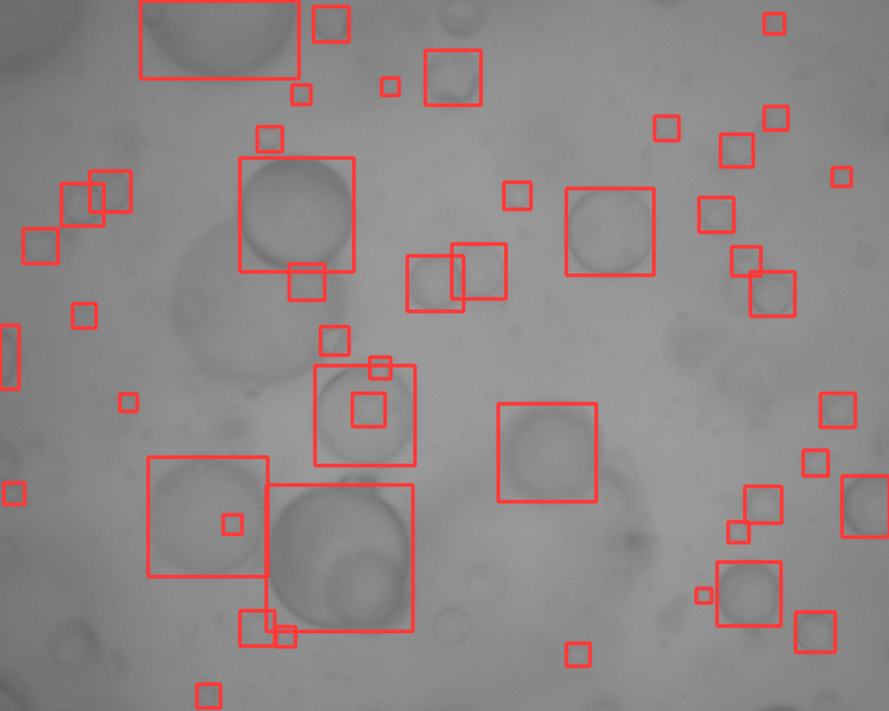
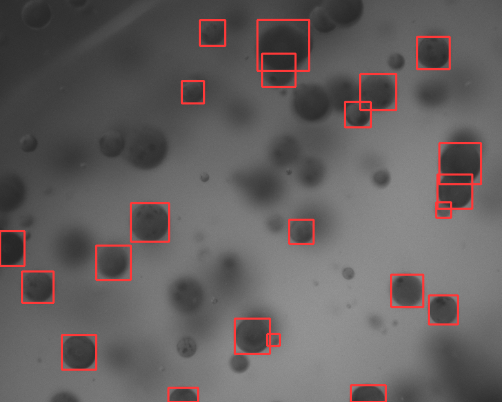
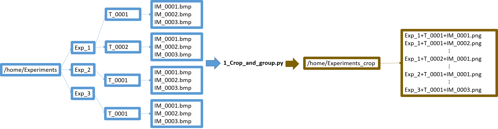
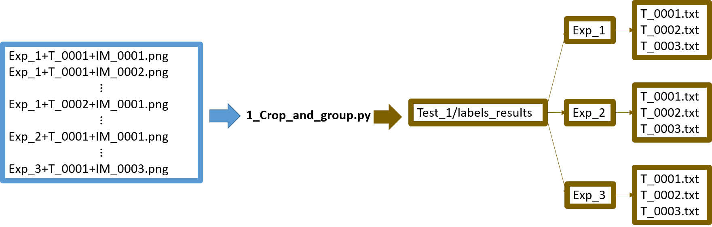

# Enhancing droplet detection in liquid-liquid systems through machine learning and synthetic imaging

BYGDrop
---------
[[Published Paper](https://www.frontiersin.org/journals/chemical-engineering/articles/10.3389/fceng.2024.1415453/full)]

A new image processing machine learning algorithm for droplet detection in liquid-liquid systems is presented. The method combines three main numerical tools: YOLOv5 for object detection, Blender for synthetic image generation, and CycleGAN for image texturing. Consequently, it was named BYG-Drop for Blender-YOLO-cycleGAn droplet detection. 

✔ In this repository, you will find the weights of the YOLOv5 neural network trained on light and dark synthetic images after texturing by CycleGAN. Using these  weights for droplet detection allows to outperform traditional image processing techniques in terms of both accuracy and number of droplets detected in digital test cases. When applied to experimental images, the results remain consistent with established techniques such as laser diffraction, while outperforming other image processing techniques in terms of drop detection accuracy. Finally, the processing time per image is significantly faster with this approach.

YOLOv5 detection examples
----------
 

Example of detection on an image with light texture using the network trained on synthetic images with light texture.

 

Example of detection on an image with dark texture using the network trained on synthetic images with dark texture.

Getting started
---------
1. We recommend that you install Python 3.8. [[Python](https://www.python.org/)]

2. Install YOLOv5.

```bash
pip install yolov5==6.0.6
```

3. ⚠⚠⚠ Very important: We have split the original weight files into smaller files to be able to upload the weights to GitHub. ⚠⚠⚠
    
    To rebuild the original weights for use with YOLOv5, please run the following codes:

    1. Install filesplit:

    ```bash
    pip install filesplit==4.0.1
    ```

    2. Reconstruct the weights:

    ```bash
    python weights/YOLO_weights/merge.py
    ```

4. Detection with YOLOv5 and with a confidence treshold of 0.95.

    1. Detection on a 1280×1024 image with light texture.

    ```bash
    yolov5 detect --weights "weights\YOLO_weights\light_texture.pt" --source "figs/light_texture.png" --save-txt --save-conf --hide-conf --conf-thres 0.95 --hide-labels --imgsz 1280 --iou-thres 0.6 --name detection_light_texture
    ```

    ✅ The detection results are in runs/detect/detection_light_texture

    2. Detection on a 1280×1024 image with dark texture.

    ```bash
    yolov5 detect --weights "weights\YOLO_weights\dark_texture.pt" --source "figs/dark_texture.png" --save-txt --save-conf --hide-conf --conf-thres 0.95 --hide-labels --imgsz 1280 --iou-thres 0.6 --name detection_dark_texture

    ```
    ✅ The detection results are in runs/detect/detection_dark_texture

For more information on using YOLOv5, please see the official documentation. [[YOLOv5 doc](https://docs.ultralytics.com/yolov5/)]

5. Processing of large quantities of images

    If you have a large number of images, we provide some code.

    1. The first code allows the images to be cropped and regrouped in the same repertory. If the image is larger than 1280×1024, this code will crop the image and keep the centre to obtain a 1280×1024 image. Do not use this code if your images are smaller than 1280×1024.

    It assumes that you have the following repertoire structure and that all the images to be processed have the same texture (light or dark):

     

    ```bash
    python processing/1_Crop_and_group.py --im_dir "/home/experiments"
    ```

    2. After you have grouped all the images in the same directory, you can run detections with YOLOv5:

    With the following option, YOLOv5 will put the detection results into the repertory yolov5/runs/detect/Test_1. The repertories runs, detect, Test_1 will be automatically created for you if they don't already exist.

    ```bash
    yolov5 detect --weights "weights\YOLO_weights\light_texture.pt" --source "/home/experiments_crop" --save-txt --save-conf --hide-conf --conf-thres 0.95 --hide-labels --imgsz 1280 --iou-thres 0.6 --name Test_1
    ```
    3. After making detections, YOLOv5 returns a file for each image containing information about the predicted bounding boxes. Since YOLOv5 has been trained to detect spherical droplets, one side of the predicted bounding box corresponds to the diameter of the droplets. The following code groups the particle diameters in pixels into a text file for each time step.

    This code rebuilds the initial repertory structure:

     

    ```bash
    python processing/2_YOLO_labels_processing.py --label_dir "../yolov5-master/runs/detect/Test_1"
```

If you use our weights in your research, please cite our article:

```bibtex
@article{,
   author = {Bana Grégory, Fabrice Lamadie, Sophie Charton, Tojonirina Randriamanantena, Didier Lucor, Nida Sheibat-Othman},
   title = {BYG-Drop, a tool for enhanced droplet detection in liquid-liquid systems through machine learning and synthetic imaging},
   journal = {Front. Chem. Eng.},
   DOI = {doi: 10.3389/fceng.2024.1415453},
   url = {https://www.frontiersin.org/journals/chemical-engineering/articles/10.3389/fceng.2024.1415453/abstract},
   volume={6},
   year={2024},
   publisher={frontiers}
}
```